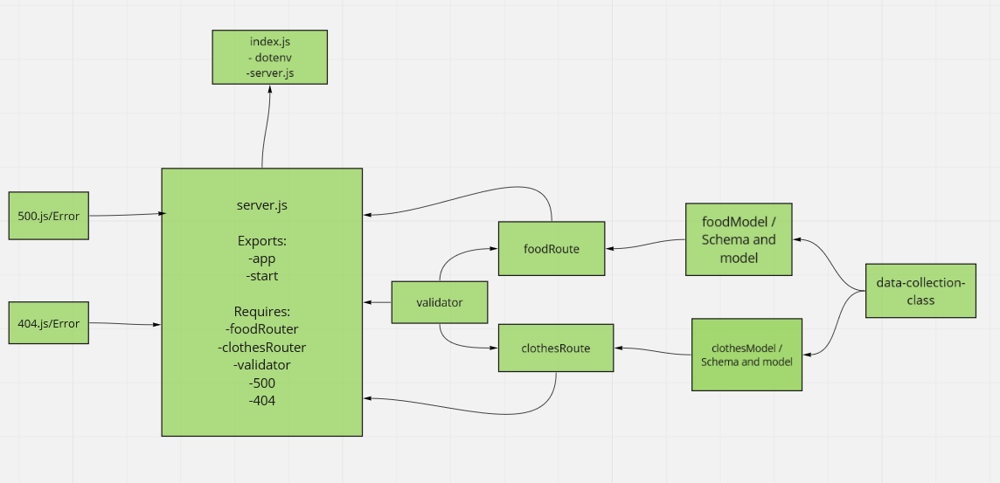

# api-server

## My notes

I create a server for the backend and some test

## Pull_request for the repo

https://github.com/baraahalomari/api-server/pull/1

## Github actions

https://github.com/baraahalomari/api-server/actions

## Heroku applications

https://balomari-api-server.herokuapp.com/

## UML diagram

